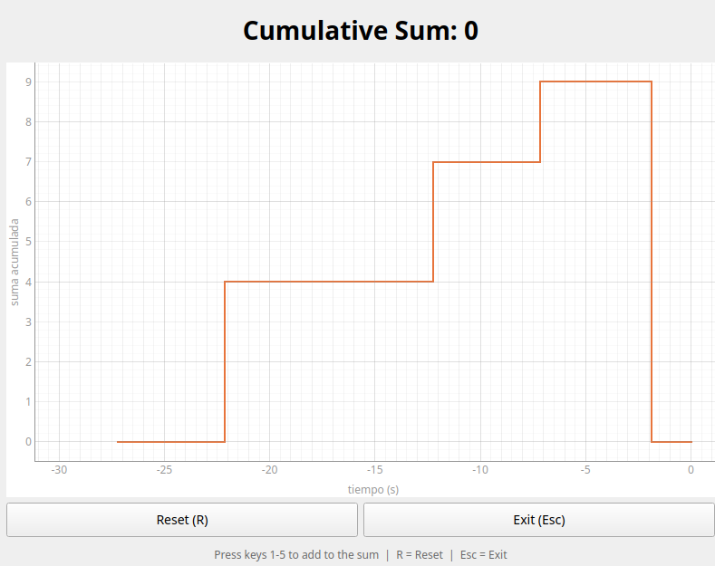

# Exercise 1: Cumulative Sum with Live Graph

## Problem Statement

Develop a Python program that plots in real time the cumulative sum of values entered by the user via keyboard, maintaining a history of the sum.

### Requirements
1. Register when the user presses numeric keys '1' through '5'
2. Display the cumulative sum of the pressed keys
3. Include a reset button
4. Plot the cumulative sum over the last 30 seconds vs. time (live updating graph)
5. Include an exit button

## Approach & Design Decisions

### Technology Stack
- **PyQt5** — Main GUI framework. Chosen because the job posting specifically lists PyQt5 as a preferred skill.
- **pyqtgraph** — Real-time plotting library. Selected over matplotlib for its superior performance with live data and native Qt integration.
- **numpy** — Required dependency for pyqtgraph.

### Architecture

The application is implemented as a single file (`main.py`) with one main class:

**`CumulativeSumApp(QMainWindow)`** — Manages the entire application:

| Component | Implementation |
|---|---|
| Key capture | `keyPressEvent()` override: keys 1-5 add to the accumulator |
| Sum display | `QLabel` with large centered font |
| History | List of `(timestamp, sum_value)` tuples |
| Live graph | `pyqtgraph.PlotWidget` refreshed via `QTimer` at ~30 FPS |
| Time window | Last 30 seconds (X: -30 to 0, Y: cumulative sum) |
| Graph type | **Step function** (staircase) — horizontal lines between events |
| Reset | Sets sum to 0, records the reset in history |
| Exit | Closes the application |

### Key Design Decisions

1. **Step function rendering**: The graph shows horizontal lines between keypress events with vertical jumps at each event. This matches the example graphs provided in the assignment, where the sum stays constant between key presses.

2. **Sliding window with anchoring**: History older than 30 seconds is pruned to keep memory bounded, but the last point before the cutoff is retained to properly anchor the left edge of the graph.

3. **Reset behavior**: Reset does not clear history — it adds a new point `(now, 0)` so the graph correctly shows the drop to zero as part of the visual history.

4. **Timer-based refresh at 30 Hz**: The `QTimer` refreshes the plot every ~33ms. This provides smooth animation without excessive CPU usage.

5. **Orange plot color**: Matches the style shown in the assignment example screenshots.

## How to Run

```bash
# Install dependencies and create virtual environment
uv sync

# Run the application
uv run python main.py
```

## Controls

| Control | Action |
|---|---|
| Keys `1` - `5` | Add the pressed number to the cumulative sum |
| `R` key or Reset button | Reset the sum to zero |
| `Esc` key or Exit button | Close the application |

## How It Works (for explanation purposes)

### Data Flow

1. **User presses a key** (e.g., '4') → `keyPressEvent()` is triggered
2. The key code is converted to an integer: `value = key - Qt.Key_0` → 4
3. The cumulative sum is updated: `self._cumulative_sum += value` → 4
4. A new entry is added to the history: `(current_time, 4)`
5. The label is updated to show "Cumulative Sum: 4"

### Graph Update (runs 30 times per second)

1. Calculate the cutoff time: `now - 30 seconds`
2. Prune history entries older than the cutoff (keep the last one before cutoff for anchoring)
3. Convert timestamps to relative time (where 0 = now, -30 = 30 seconds ago)
4. Build step-function data by duplicating points at transitions:
   - For each new value, first draw a horizontal line from the previous value to the current timestamp
   - Then draw the vertical jump to the new value
5. Extend the last value to `t=0` (current moment)
6. Update the pyqtgraph curve with the new data

## Screenshots



## Time Spent

| Task | Time |
|---|---|
| Design & planning | 25 min |
| Implementation | 90 min |
| Manual testing & fixes | 30 min |
| Documentation | 20 min |
| **Total** | **165 min (~2h 45min)** |
