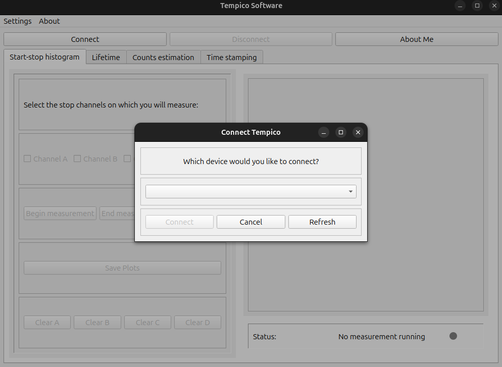
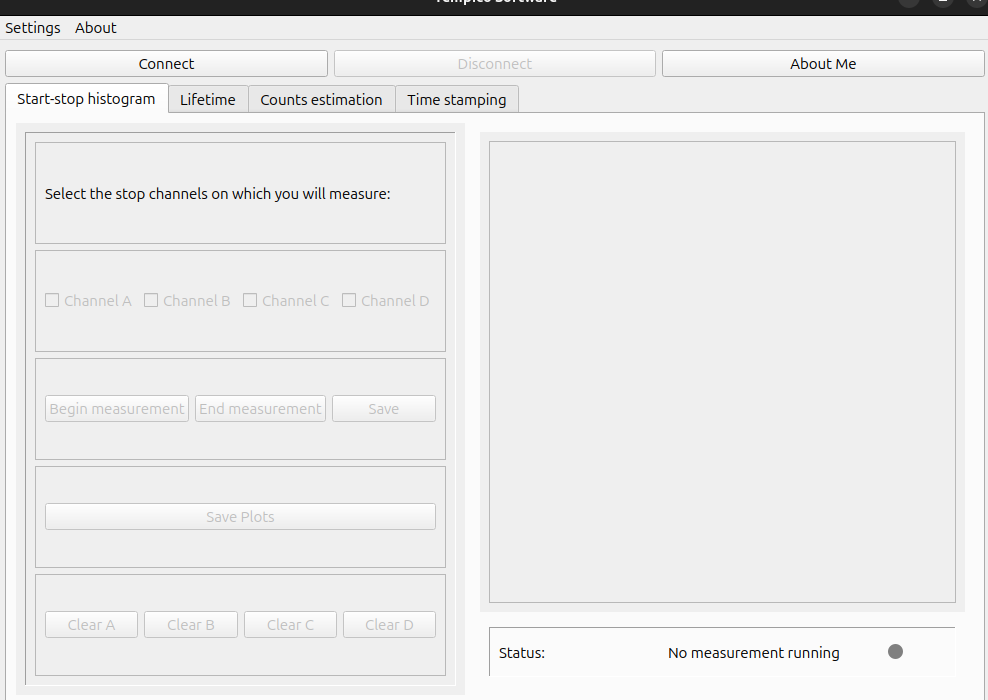

# Exercise 2: TempicoSoftware — Execution & Editing

## Problem Statement

Download the [TempicoSoftware](https://github.com/Tausand-dev/TempicoSoftware) source code and:

1. **Run** `src/main.py` — identify and install the required packages
2. **Add an "About Me" button** next to "Connect" and "Disconnect" that triggers the same action as the "About / About Tempico Software" menu
3. **Edit the About dialog** content to include a personal positive programming experience (max 300 words, in English)

## Setup & Execution

### Prerequisites
- **Python 3.9** (PySide2 5.15.2.1 does not have wheels for Python 3.10+)
- A virtual environment is recommended

### Installation

```bash
cd TempicoSoftware

# Create and activate virtual environment (recommended)
python3.9 -m venv venv
source venv/bin/activate

# Install dependencies
pip install -r requirements.txt
```

### Running the Application

**Important:** Run from the `TempicoSoftware/` root directory (not from `src/`), because image paths in the code are relative to the working directory.

```bash
python src/main.py
```

The application will show:
1. A splash screen (1 second)
2. The main window with a "Connect Tempico" dialog — click **Cancel** to continue (no hardware device needed)
3. The main interface with Connect, Disconnect, and **About Me** buttons

## Modifications Made

### 1. Added "About Me" Button (`src/main.py`)

**3 lines added**, following the exact same pattern as the existing Connect/Disconnect buttons:

```python
# Line 233: Create the button (alongside Connect and Disconnect)
self.aboutMeButton = QPushButton("About Me", self)

# Line 238: Add to the button layout
buttonLayout.addWidget(self.aboutMeButton)

# Line 268: Connect the click signal to the existing about_settings method
self.aboutMeButton.clicked.connect(self.about_settings)
```

**Why this approach:**
- The requirement says the button should "do the same action as the About / About Tempico Software menu". The `about_settings()` method (line 1015) is exactly that action — it creates a `QDialog` with `Ui_AboutDialog` and shows it modally.
- By reusing the existing method, we follow the DRY principle and maintain consistency with the codebase.
- The button is placed in the same `QHBoxLayout` as Connect/Disconnect, matching the UI layout requested in the assignment screenshot.

### 2. Edited About Dialog Content (`src/Utils/aboutDialog.py`)

**Changes:**
- Increased dialog height from 323px to 560px to accommodate the new section
- Added a new `QFrame` ("aboutMeFrame") with a title label and a word-wrapped text label containing the personal experience (243 words, in English)

**Why a separate frame instead of replacing existing content:**
- The original Tempico Software description, version info, and links remain intact
- The personal section is clearly separated with a bold title
- This approach respects the original application while fulfilling the requirement

### About Me Text Content

The text describes:
- My Electronic Engineering degree at Universidad Surcolombiana
- Building an RFID-based asset inventory system with Raspberry Pi, PyQt, and pySerial
- Professional backend experience at Ruedata processing sensor data with Python, Django, and AWS
- How this hardware-software dual perspective connects to Tausand's mission

## Understanding the Codebase (Key Concepts)

### Framework: PySide2
TempicoSoftware uses **PySide2** (Qt for Python), which is the official Python binding for Qt. It is very similar to PyQt5 — the main differences are licensing (PySide2 is LGPL) and minor API variations.

### Architecture
The application follows a multi-threaded MVC-inspired pattern:
- **Views/** — UI layout definitions (programmatic, not `.ui` files)
- **Logic/** — Business logic for each measurement mode
- **Threads/** — Background worker threads for continuous data acquisition
- **Utils/** — Shared utilities (about dialog, settings, device finder, constants)

### How the About Dialog Works
1. User clicks "About Me" button (or "About / About Tempico Software" menu)
2. `about_settings()` method is called (line 1015 of `main.py`)
3. A new `QDialog` is created
4. `Ui_AboutDialog.setupUi()` programmatically builds the dialog UI
5. `dialog.exec_()` shows it as a **modal** window (blocks the main window until closed)

## Screenshots

### Initial launch with Connect Tempico dialog


### Main window with About Me button


### About dialog with personal experience


## Time Spent

| Task | Time |
|---|---|
| Setup and installation (Python 3.9 + dependencies) | 30 min |
| Codebase exploration and understanding | 25 min |
| Adding About Me button | 15 min |
| Editing About dialog content | 20 min |
| Manual testing and fixes | 20 min |
| Documentation | 15 min |
| **Total** | **125 min (~2h 5min)** |
